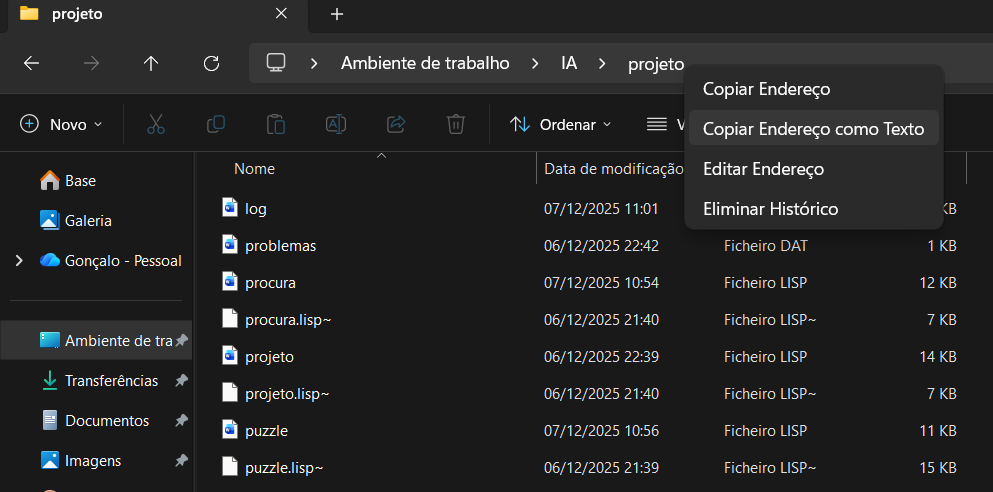

# Manual do Utilizador
## Projeto Nº1 – Solucionador do Puzzle Solitário
## Unidade Curricular: Inteligência Artificial
## Escola Superior de Tecnologia de Setúbal – 2025/2026

**Autores:**
- Gonçalo Barracha – 202200187
- Rodrigo Cardoso – 202200197

---

## 1. Introdução
Este programa resolve automaticamente o puzzle Solitário utilizando algoritmos de procura (BFS, DFS e A*). O objetivo é deixar apenas um pino no tabuleiro. O utilizador pode escolher o problema inicial, o algoritmo e a heurística, e o programa gera relatórios detalhados da execução em `log.dat`.

---

## 2. Iniciar o Programa
Como obter caminho do projeto:


Exemplo: (cd "C:/Users/gonga/Desktop/IA/projeto")
Nota: transformar as "\\" em "/" \
Após carregar os ficheiros `.lisp`, executar:
```
cd ("caminho do projeto")
Compilar ficheiro "projeto.lisp"
(iniciar)
```
Surge um menu guiado que permite selecionar problema, algoritmo e heurística.

---

## 3. Seleção do Problema
O programa lê `problemas.dat` e mostra todos os tabuleiros graficamente. O utilizador escolhe um problema introduzindo o número correspondente.

---

## 4. Seleção do Algoritmo
O menu permite escolher:
- **BFS**: solução ótima, muito consumo de memória.
- **DFS**: rápido, mas pode não encontrar solução profunda.
- **A\***: usa heurísticas; normalmente mais eficiente.

DFS solicita profundidade limite.

---

## 5. Seleção da Heurística
Se A* for escolhido:
- **Heurística padrão**: h(x) = 1 / (o(x) + 1)
- **Heurística de isolamento**: penaliza pinos isolados.

---

## 6. Relatório Automático
O programa gera automaticamente em `log.dat`:
- Algoritmo usado
- Tempo de execução
- Nós gerados e expandidos
- Penetrância
- Fator de ramificação médio
- Caminho da solução com tabuleiros

---

## 7. Interpretação das Estatísticas
- **Nós Gerados:** total de estados criados.
- **Nós Expandidos:** estados cujos sucessores foram avaliados.
- **Penetrância:** profundidade / nós gerados.
- **Fator de Ramificação Médio:** média de sucessores.
- **Caminho da Solução:** sequência desde o estado inicial.

---

## 8. Encerramento
O programa pergunta se deseja resolver outro problema. Selecionar `2` termina a execução.

## 9. Notas Finais
* A interface foi melhorada com a ajuda de Inteligência Artificial(ChatGPT) para uma melhor legibilidade da mesma.
* O mesmo se aplica a função "gerar-todos-os-estados filhos" onde a mesma foi otimizada com recurso à mesma ferramenta.
* Quanto ao fator de ramificação médio , a função da bisseção  conjunta com a de Newton-Raphson (retirada dos slides) foi adaptada ao código do projeto com a ajuda do ChatGPT.

